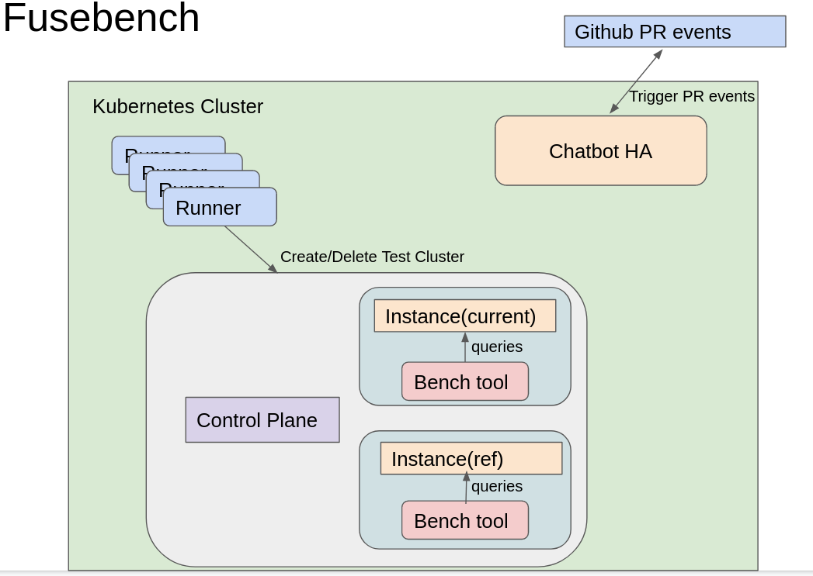

# test-infra
This repository contains tools and configuration files for the testing, benchmarking and automation needs of the databend projects.

## Functions and Features
1. Fast CI speed, By design one performance testing should not exceed two hours(including docker build time and performance testing running time)
2. Expandable: supports to deploy performance tests on scale, and also supports to deploy on a single machine for affordable CI
3. Cloud Native supports: Should be able to deploy whole platform on different cloud providers like GKE, EKS
4. High Availability: supports server instances self-healing and do not have single point failure 
5. Observability: whole process should be observable, should collect logs for performance running instances and collect compare report results

## TODOs
1. Cloud provider interface implementation
2. dashboard for unified monitoring
3. prometheus and grafana integration

## Databend performance tests:
Steps:
1. Chatbot receive PR comments for performance testing
2. Chatbot validate on commenter’s permission
3. Trigger performance docker image build for current and reference instance
4. Create new cluster for testing
5. Deploy instances and performance tool on it
6. Run performance testings and collect performance results
7. Clean up and delete all created resources(cluster and docker image layer)

